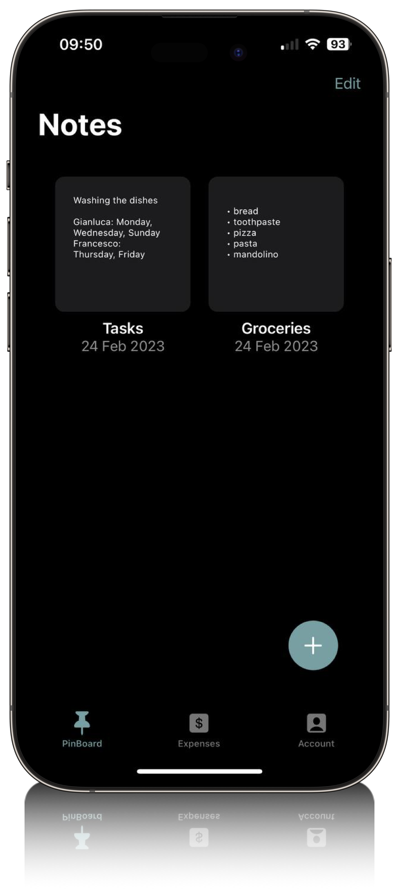
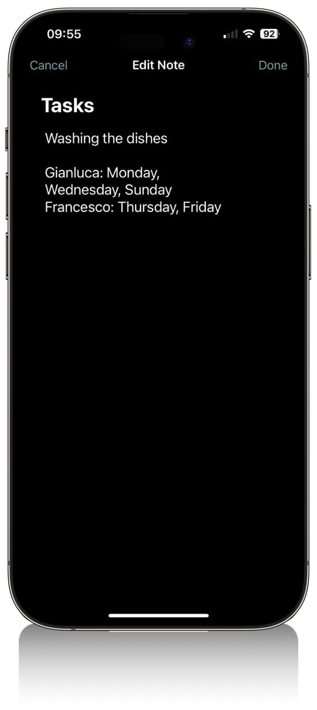

<h1>FlatMate</h1>

**FlatMate** is an app created for a challenge when I attended tthe Apple Foundation Course. It was developed just in 10 days using Swift and Cloud Firestore as database. There are plenty feature missing so take this project as a portfolio display.

## Features

### 📋 List Expenses:
Effortlessly keep tabs on shared expenses in a centralized list. Elevate your organizational game and stay in the know about every contribution.

### 🗒️ Notes:
Collaboration reaches new heights as FlatMate allows you to seamlessly share and manage important notes. From shopping lists to maintenance reminders, stay ahead of the game.

### 📅 Tasks:
Transform the way you manage your shared living space. Assign and handle tasks effortlessly, enhancing communication and ensuring everyone plays a crucial role in maintaining a harmonious living environment.

### 💸 Expense Tracking:
Unleash the power of robust expense tracking to gain insights into your group's spending habits. Visualize the flow of money, enabling informed financial decisions that bring everyone together.

---

 
 
 

